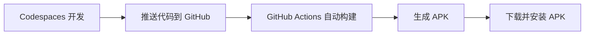

# 图片编辑器 - Capacitor Android APK

基于 Capacitor + Vue 3 + TypeScript 的图片编辑 Android 应用，使用 GitHub Actions 自动构建 APK，无需本地 Android 开发环境。

## 功能特性

- 图片选择（相册/相机）
- 基础编辑功能
  - 裁剪
  - 旋转（90°）
  - 水平/垂直翻转
- 滤镜效果
  - 原图
  - 灰度
  - 复古
  - 反色
  - 模糊
  - 提亮
- 涂鸦绘制
- 文字标注
- 保存编辑后的图片

## 技术栈

- **前端框架**: Vue 3 + TypeScript + Vite
- **跨平台**: Capacitor 5
- **图片处理**: Fabric.js
- **UI**: 原生 CSS
- **构建**: GitHub Actions
- **开发环境**: GitHub Codespaces

## 开发指南

### 使用 GitHub Codespaces（推荐）

1. 在 GitHub 上创建新仓库
2. 点击 `Code` -> `Codespaces` -> `Create codespace on main`
3. Codespaces 会自动配置开发环境
4. 运行开发服务器：
   ```bash
   npm run dev
   ```
5. 在浏览器中预览：`http://localhost:5173`

### 本地开发

如果已有 Node.js 环境：

```bash
# 安装依赖
npm install

# 启动开发服务器
npm run dev

# 构建生产版本
npm run build
```

## APK 构建

### 自动构建（推荐）

1. 推送代码到 GitHub 仓库的 `main` 或 `master` 分支
2. GitHub Actions 自动触发构建
3. 构建完成后，在仓库的 `Actions` -> `Build Android APK` 中下载 APK
4. 或者在 `Releases` 页面下载自动发布的 APK

### 手动触发构建

1. 进入 GitHub 仓库
2. 点击 `Actions` 标签
3. 选择 `Build Android APK` 工作流
4. 点击 `Run workflow` 按钮
5. 等待构建完成后下载 APK

## 项目结构

```
.
├── .devcontainer/          # Codespaces 配置
│   └── devcontainer.json
├── .github/                # GitHub 配置
│   └── workflows/
│       └── build-apk.yml   # APK 构建工作流
├── src/                    # 源代码
│   ├── components/         # Vue 组件
│   │   ├── ImageEditor.vue # 主编辑器
│   │   ├── ImageCanvas.vue # Canvas 画布
│   │   └── Toolbar.vue     # 工具栏
│   ├── types/              # TypeScript 类型定义
│   ├── App.vue             # 根组件
│   ├── main.ts             # 入口文件
│   └── style.css           # 全局样式
├── public/                 # 静态资源
├── capacitor.config.ts     # Capacitor 配置
├── vite.config.ts          # Vite 配置
├── tsconfig.json           # TypeScript 配置
└── package.json            # 项目配置
```

## 工作流程



## 自定义配置

### 修改应用 ID

编辑 `capacitor.config.ts`：

```typescript
const config: CapacitorConfig = {
  appId: 'com.yourcompany.yourapp',
  appName: '你的应用名称',
  // ...
};
```

### 修改 Android 配置

在首次构建后，会生成 `android` 目录。可以修改：
- `android/app/src/main/AndroidManifest.xml` - 权限和配置
- `android/app/build.gradle` - 构建配置（版本号、签名等）

### 添加签名

1. 生成密钥库：
   ```bash
   keytool -genkey -v -keystore my-release-key.jks -keyalg RSA -keysize 2048 -validity 10000 -alias my-alias
   ```

2. 在 GitHub 仓库设置中添加 Secrets：
   - `KEYSTORE_BASE64`: 密钥库的 base64 编码
   - `KEYSTORE_PASSWORD`: 密钥库密码
   - `KEY_ALIAS`: 密钥别名
   - `KEY_PASSWORD`: 密钥密码

3. 修改 `.github/workflows/build-apk.yml` 添加签名步骤

## 常见问题

### Q: 为什么选择 GitHub Actions？
A: 无需本地 Android 环境，自动构建，易于分发。

### Q: 如何调试？
A: 在 Codespaces 中使用浏览器开发工具调试 Web 版本。

### Q: 如何测试 APK？
A: 构建完成后下载 APK，在 Android 设备上安装测试。

### Q: 构建失败怎么办？
A: 查看 GitHub Actions 日志，通常是依赖或配置问题。

## 许可证

MIT

## 贡献

欢迎提交 Issue 和 Pull Request！
